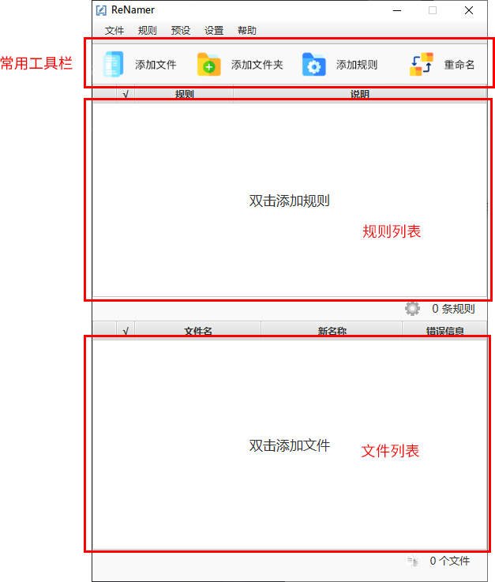
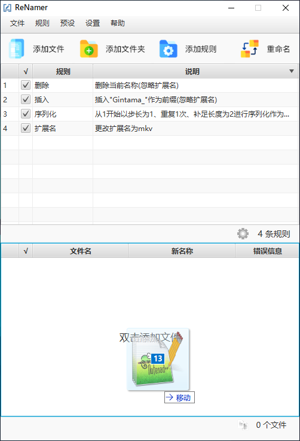
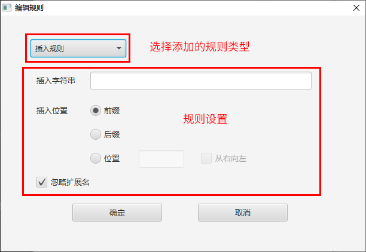
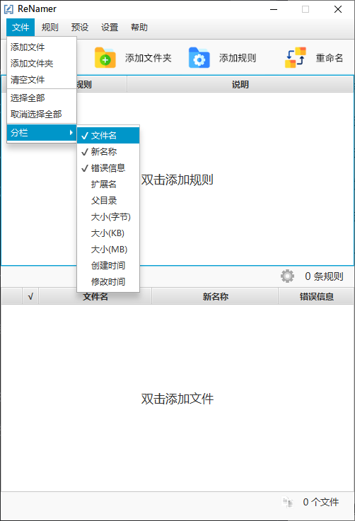
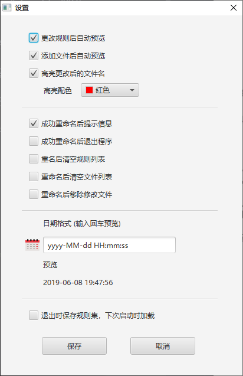
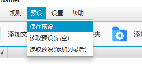
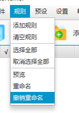
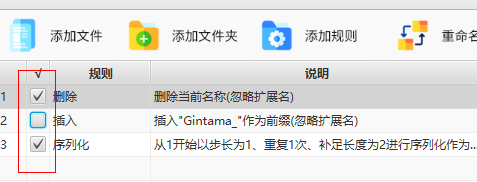
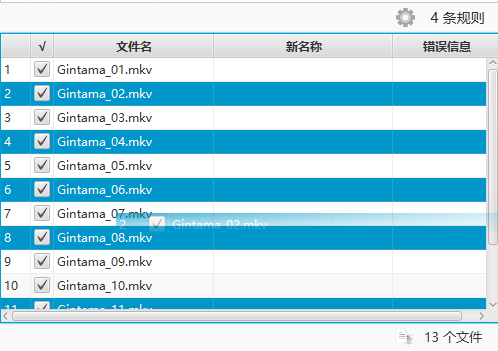
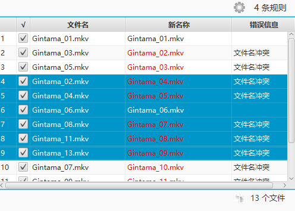

# ReNamer用户手册

## 概述

ReNamer是一个灵活且高效的批量文件重命名工具

ReNamer提供了插入、删除、替换、增量序列化等常用文件命名规则，进阶用户可以使用正则表达式自定义文件名规则

## 使用方法

ReNamer的界面如下

    

使用流程

1. 点击工具栏添加文件或者双击文件列表可以添加要重命名的文件

    点击工具栏添加文件夹可以将文件夹下的所有直接文件批量添加到列表中

    同时支持将文件(夹)拖拽到文件列表中

    

        
    

2. 点击工具栏添加规则或者双击规则列表添加重命名规则

    规则编辑界面如下

    

        
    

    通过顶部选项卡可以切换不同类型的命名规则

    中间的规则配置区可以根据自己的需求来设置

3. 默认设置下添加完规则就会产生命名预览

4. 确认无误后点击工具栏重命名进行命名

## 功能

### 配置文件列表分栏

点击顶部菜单 **文件 -> 分栏** 菜单，即可改变文件列表中显示的分栏

    

### 更改ReNamer设置

点击顶部菜单 **设置 -> 选项** 菜单，即可打开设置编辑器

界面如下

    

设置选项卡中的 **恢复默认** 可以恢复默认设置

### 使用规则预设

为了提高效率，可以将常用的规则组合保存为一个预设文件

点击顶部菜单 **预设 -> 保存预设** 菜单，即可将规则集保存为一个`.rnp`后缀文件

    

预设选项卡下的 **读取预设** 选项可以打开一个`.rnp`后缀的文件并加载保存的规则集

### 撤销重命名

为了防止误操作，ReNamer提供一次撤销重命名的操作，将文件还原为重命名之前的名字

点击顶部菜单 **规则 -> 撤销重命名** 菜单

    

### 列表操作

1. 可以通过暂时不用的规则或文件取消勾选

    

        
    

2. 支持多行拖拽排序

    

        
    

    结果

    

        
    
